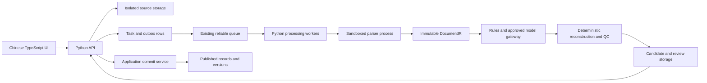

# Architecture and implementation boundaries

The original specification is in `design/Protein_Sequence_App_Design_v1.0_EN.md`. This document maps its sections to code ownership; it does not replace its contracts.

## Runtime flow

API and worker processes run from the same backend package. They can scale independently without separate service repositories. Only the commit application service may write approved published versions. The model gateway receives authorized blocks and returns structured locations and observations; it has no database, shell, network-search, or commit capability, and it never assigns candidate IDs or QC severities ([ADR 0002](decisions/0002-extraction-contract-boundaries.md)). Parsers run in a credential-free sandboxed process, and task creation uses a transactional outbox ([ADR 0003](decisions/0003-parser-isolation-and-task-enqueue.md)).

## Dependency direction

`api` and `workers` call `application`; `application` depends on `domain` and port interfaces defined with the relevant use case. `adapters` implement those ports. Composition at process entry points wires concrete implementations. Domain modules must not import HTTP frameworks, queues, ORM libraries, or model SDKs.

| Folder | Responsibility | Design sections |
| --- | --- | --- |
| `apps/web/src/features` | Upload/task progress, evidence review, search, version history, admin | 2, 7 |
| `services/backend/src/sequence_vault/domain` | Immutable evidence, QC outcomes, revision and version invariants | 3–8 |
| `services/backend/src/sequence_vault/application` | Permission-aware uploads, orchestration, reviews, atomic item commits | 3, 7–8 |
| `services/backend/src/sequence_vault/api` | `/v1` transport, authorization context, error/response contracts | 8 |
| `services/backend/src/sequence_vault/workers` | Scan → parse → extract → validate, leases and cancellation | 3, 9 |
| `services/backend/src/sequence_vault/adapters/parsers` | Format detection, parser registry, immutable IR and coverage warnings | 4–5, 9 |
| `services/backend/src/sequence_vault/adapters/ai` | Approved endpoints, structured output, versioned prompts | 4, 9 |
| `database/migrations` | Tenant/project constraints, evidence, candidates, reviews, versions, audit | 8 |
| `packages/contracts` | Shared wire formats and Unicode code-point offsets | 4, 8 |
| `config`, `prompts` | Versioned policy, QC definitions, extraction instructions | 4, 6, 9 |
| `tests`, `tools/evaluation` | Exception cases, frozen benchmarks and acceptance reports | 10 |
| `infrastructure`, `docs/operations` | Isolation, deployment, telemetry, recovery and rollback | 9, 11 |
| `tools/legacy_migration` | Separate, traceable import and reconciliation | 11 |

## Storage boundaries

Store source files and evidence objects in isolated object storage. Use generated object keys, never filenames as paths. PostgreSQL stores projects/memberships, files, extraction runs, blocks, candidate revisions, QC issues, reviews, sequence entities, records, versions, provenance, and audit events.

Sequence deduplication is tenant-scoped and verifies full content after a hash match. Project application records govern visibility; sharing an entity cannot disclose another project's data. Uniqueness belongs in database constraints as well as transaction logic. Temporary original/evidence download links require renewed authorization and short expiry.

## Lifecycle and concurrency

File tasks follow `UPLOADED → SCANNING → PARSING → EXTRACTING → VALIDATING → REVIEW_READY → COMPLETED`, with failure/cancellation exits and `UNSUPPORTED` for unsupported formats. Completion requires every candidate to be committed, rejected, or explicitly archived. Pending content keeps a task in review.

Candidate edits increment revision and invalidate approval. Issue resolutions and reviews bind to that revision and extraction run. Per-item transactions recheck authorization, scan status, cancellation, revision, approval, and QC version. Bind each idempotency key to candidate ID and approved revision. Preserve older extraction runs and published versions.

## Decisions remaining before implementation/launch

Choose frontend and Python frameworks, enterprise sign-in, task queue, dependency managers and lockfiles, approved model deployment, parser libraries, parser sandbox runtime, and deployment topology. Confirm retention, extended-residue policy, full-width and mixed-case normalization ([ADR 0004](decisions/0004-normalization-questions-for-data-owner.md)), text PDF release scope, and capacity with the data owner. OCR and automatic publication remain later phases with separate acceptance gates.
