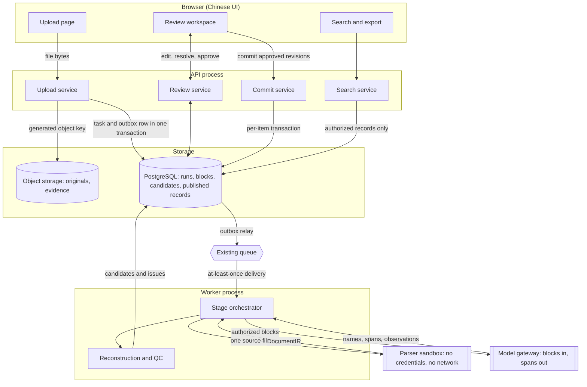
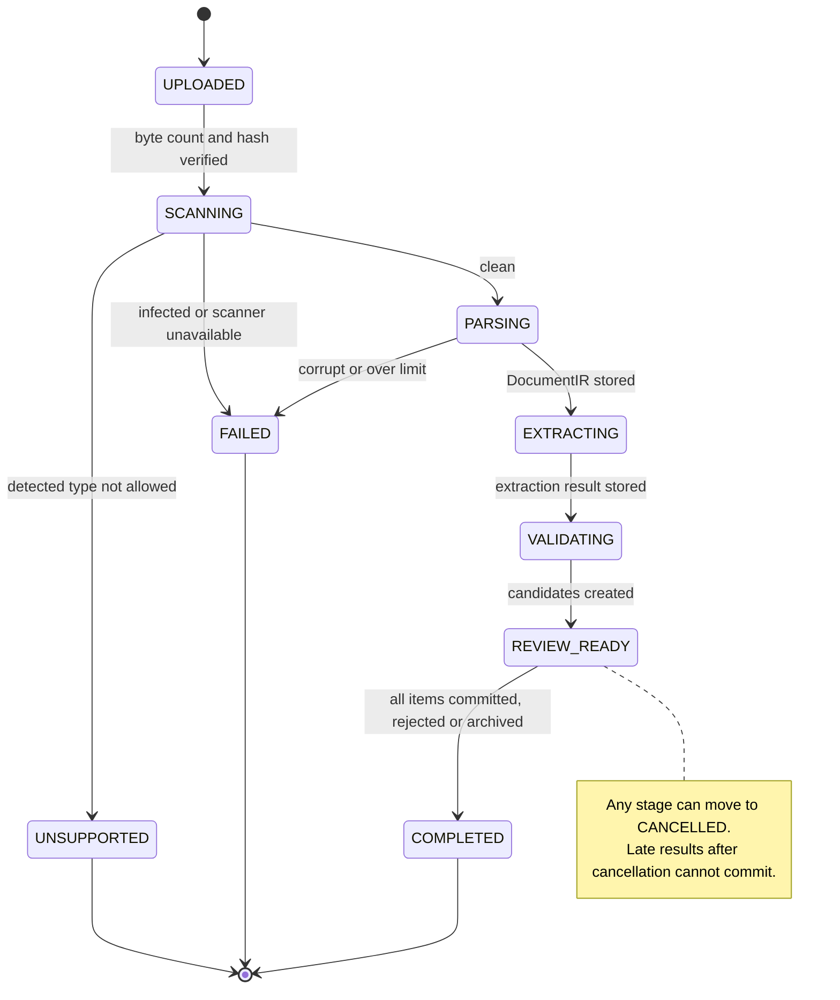
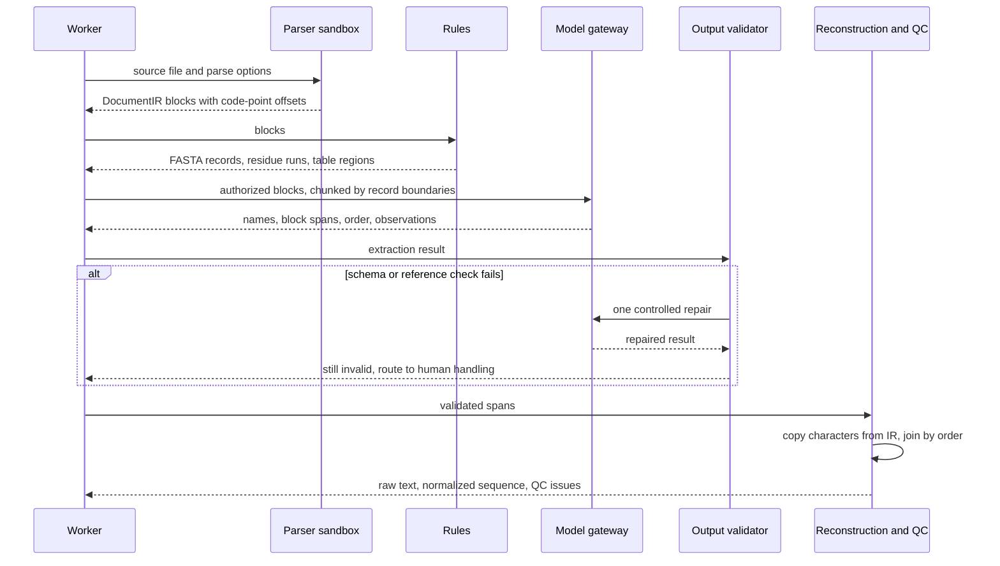
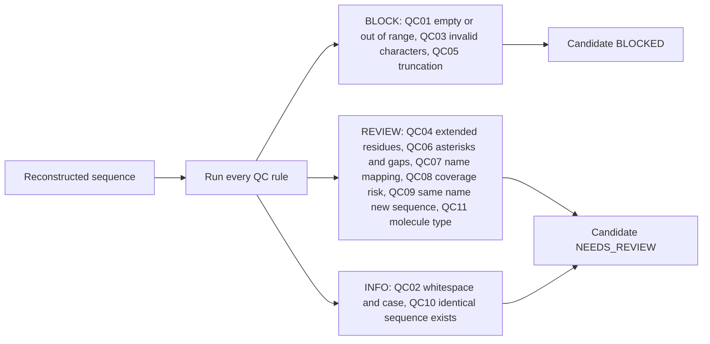
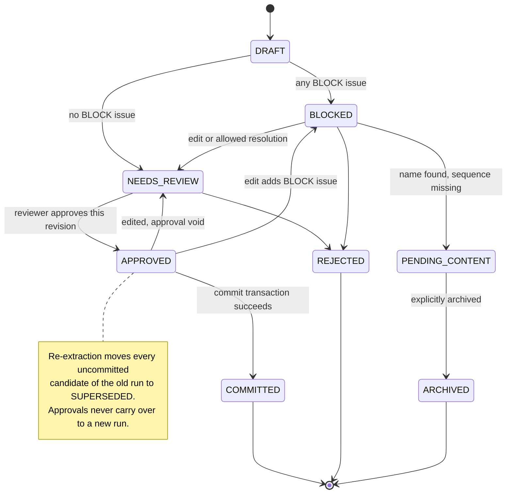
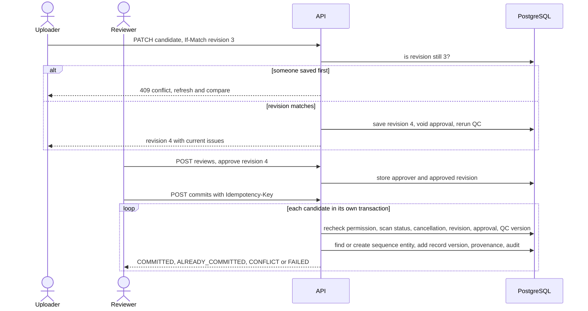
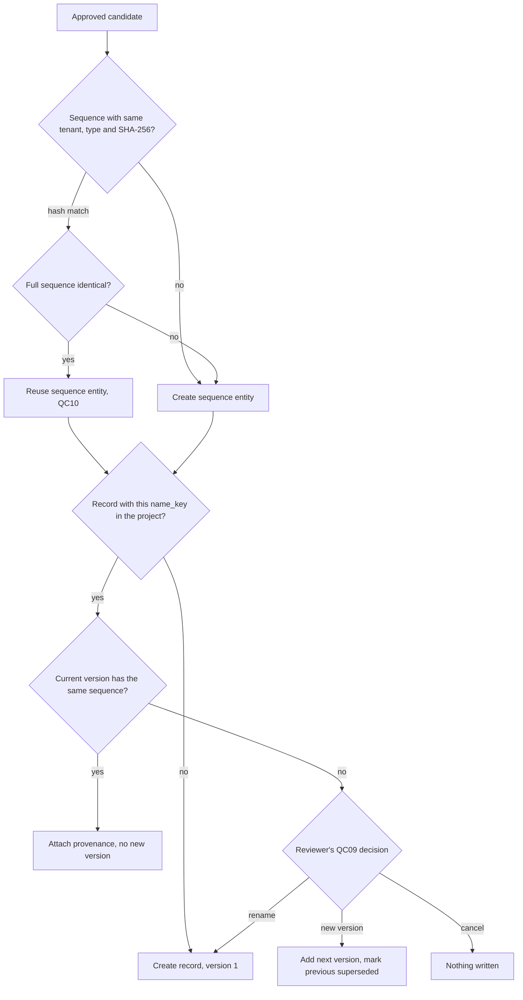

# Workflow diagrams

Visual companion to the [design specification](design/Protein_Sequence_App_Design_v1.0_EN.md) and [architecture](architecture.md). Diagrams reflect [ADR 0002](decisions/0002-extraction-contract-boundaries.md) and the proposed [ADR 0003](decisions/0003-parser-isolation-and-task-enqueue.md). The specification remains the source of truth.

## 1. System flow and trust boundaries

Files move from the browser through isolated storage, a sandboxed parser and a narrow model gateway before anything reaches the review screen. Each box is a separate process or store, and each arrow is the only data that crosses that boundary.

- Only the commit service writes published records. The model gateway has no database, shell, search or URL access.
- The parser sandbox and transactional outbox come from ADR 0003, which is still a proposal.

## 2. File task lifecycle

Every uploaded file is one task. It moves forward one stage at a time and ends in exactly one terminal state. A task stays in review while any candidate is still waiting for content.

- Transient errors retry up to 3 times with exponential backoff and jitter. Deterministic parse failures are not retried.
- Workers hold a lease with heartbeats, so a crashed worker's task is picked up again and duplicate delivery is harmless.

## 3. Two-step extraction

Rules find the obvious structure first. The model only decides which name goes with which span, and answers with locations. Software then copies the characters out of the immutable document, so a sequence is never typed by the model.

- The model never assigns candidate IDs, QC rules or severities (ADR 0002). Its self-reported confidence is not an acceptance signal.
- If the model endpoint is not approved, the AI step is disabled and rules plus manual entry still work.

## 4. Quality control

Every rule runs on every candidate. The worst severity found sets the candidate's status. BLOCK issues can only be cleared by one of the rule's listed resolutions; there is no Ignore button.

| Rule | Severity | Allowed resolutions |
| --- | --- | --- |
| QC01 | BLOCK | `correct_evidence_reference`, `mark_pending_content` |
| QC02 | INFO | `automatic_normalization` |
| QC03 | BLOCK | `correct_input`, `apply_position_numbering_rule`, `provide_source` |
| QC04 | REVIEW | `confirm_residue_semantics` |
| QC05 | BLOCK | `re_extract`, `provide_source`, `register_fragment` |
| QC06 | REVIEW | `apply_explicit_transformation`, `correct_input` |
| QC07 | REVIEW | `select_name`, `split_candidate`, `reassociate_name` |
| QC08 | REVIEW | `confirm_source_reviewed`, `reparse_with_selected_view`, `correct_input` |
| QC09 | REVIEW | `create_new_version`, `rename`, `cancel` |
| QC10 | INFO | `reuse_entity` |
| QC11 | REVIEW | `confirm_molecule_type`, `reject` |

Resolutions come from `config/qc-rules.v1.json`.

## 5. Candidate lifecycle

A candidate is one name and sequence found in one extraction run. Approval belongs to a specific revision, so any edit sends the candidate back through QC and review.

- Editing a sequence needs a reason and shows a character-level diff. The candidate's origin becomes manual_revision.
- A fragment can be registered only for the continuous sequence visible in the source, with completeness set to fragment.

## 6. Review and commit

Edits use optimistic locking on the revision number. Commits run one transaction per candidate, and every check is repeated inside that transaction, so a stale approval or a revoked permission cannot slip through.

- The idempotency key is bound to the candidate ID and approved revision, so a retry returns the same result instead of a second version.
- Any failed check rolls back that one item only. The screen shows partial success as partial.

## 7. Duplicate and version decisions

Sequence entities are shared within a tenant; records and names belong to a project. Nothing published is ever overwritten.

- name_key is the trimmed, case-folded name. Original capitalization is kept for display.
- Reusing an entity across projects never reveals that another project holds it. Access follows the project's own record.
- A version is never inferred from v2 in a filename.
